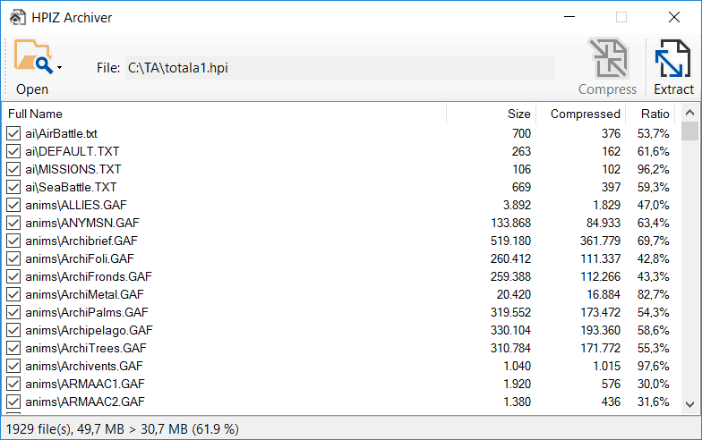

# HPIZ Archiver
A new tool for a great old game. View, extract and compress HPI files faster using multithreading and achieve maximum compression with Zopfli DEFLATE.

## Zopfli for HPI Chunks

HPIZ uses a dedicated Zopfli-derived DEFLATE encoder tuned for Total
Annihilation archives. HPI files split data into small independent chunks, so
the compressor is optimized for that chunk size instead of behaving like a
general-purpose whole-file Zopfli implementation.

## Repack Benchmark v1.4.0

Measured with `HPIZ Archiver.exe -r <archive> <destination>` from a Release x64
build.

| File             | Original Size       | Repacked Size      | Reduction | Time Elapsed |
|------------------|---------------------|--------------------|-----------|--------------|
| TA_Zero_Maps.ufo | 199 456 967 bytes   | 181 212 509 bytes  | -9.1%     | 00:02:49     |
| TAESC.gp3        |  36 269 515 bytes   |  29 177 676 bytes  | -19.6%    | 00:01:32     |
| ccmaps.ccx       | 153 714 300 bytes   | 139 289 738 bytes  | -9.4%     | 00:05:39     |
| totala4.hpi      | 147 577 290 bytes*  | 111 119 349 bytes  | -24.7%    | 00:01:57     |

*`totala4.hpi` uses the LZ77 compression method in the original archive.*

## Dependencies
Requires .NET Framework 4.8

## Screenshot

