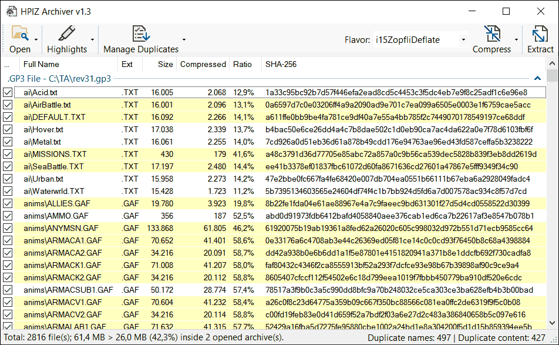

# HPIZ Archiver
A new tool for a great old game. View, extract and compress HPI files faster using multithreading and achieve maximum compression with Zopfli DEFLATE.

## Compression Benchmark r1.2.3

| File             | Original Size (zlib) | New Size (Zopfli) | Reduction | Time Elapsed |
|------------------|----------------------|-------------------|-----------|--------------|
| TA_Zero_Maps.ufo | 157 314 655 bytes    | 142 374 334 bytes | -9.5%     | ~22 minutes  |
| TAESC.gp3        |  98 026 180 bytes    |  87 266 719 bytes | -11.0%    | ~45 minutes  |
| ccmaps.ccx       | 153 714 300 bytes    | 139 269 843 bytes | -9.4%     | ~34 minutes  |
| totala4.hpi      | 147 577 290 bytes*   | 111 133 356 bytes | -24.7%    | ~16 minutes  |

**totala4.hpi uses LZ77 compression method*

## Dependencies
Requires NET Framework 4.8

## Screenshot
